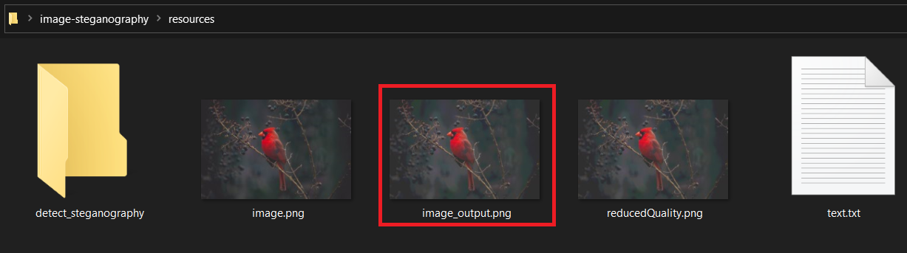

# image-steganography

## Steps to encode, detect & decode (Simulated)

1.  Clone this git repository

    detect\_steganography.py - Detects the image steganography by left shifting the pixel RGB value.

    encode\_decode.py - Encodes and Decodes the text into/from image.

2.  Copy image.png(original) and text.txt(text to hide) to resources folder

3.  Text will be converted to binary and will be encoded to image by dropping 4 LSB of image pixel bits value and copying text binary value in place.

4.  Running script to encode the text into image

5.  “image\_output.png“ (image with text hidden) will be generated in the resources folder.

6.  Analysing the image to detect steganography

7.  Image will be generated in detect\_steganography folder

8.  Encoded text is visible in the image after 4 bit left shift of pixels

9.  Decoding the text from image

## Fork of :

https://github.com/kelvins/steganography

https://github.com/rroy1212/Image_Steganography/blob/master/ImageSteganography.ipynb
